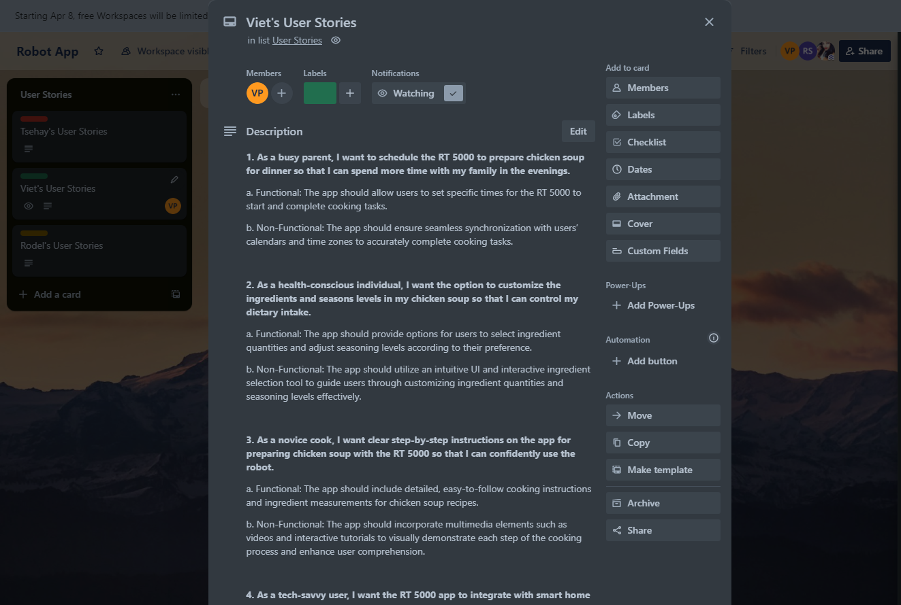
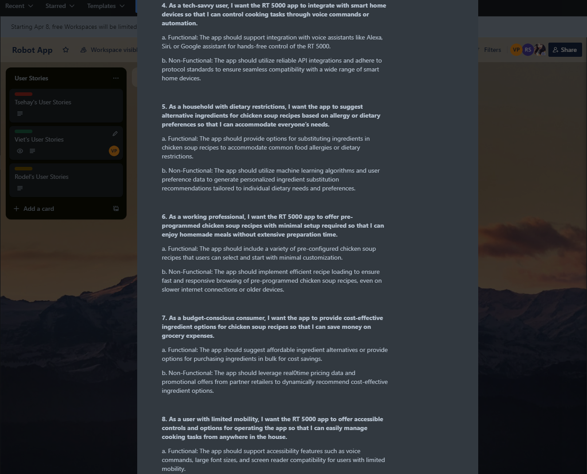
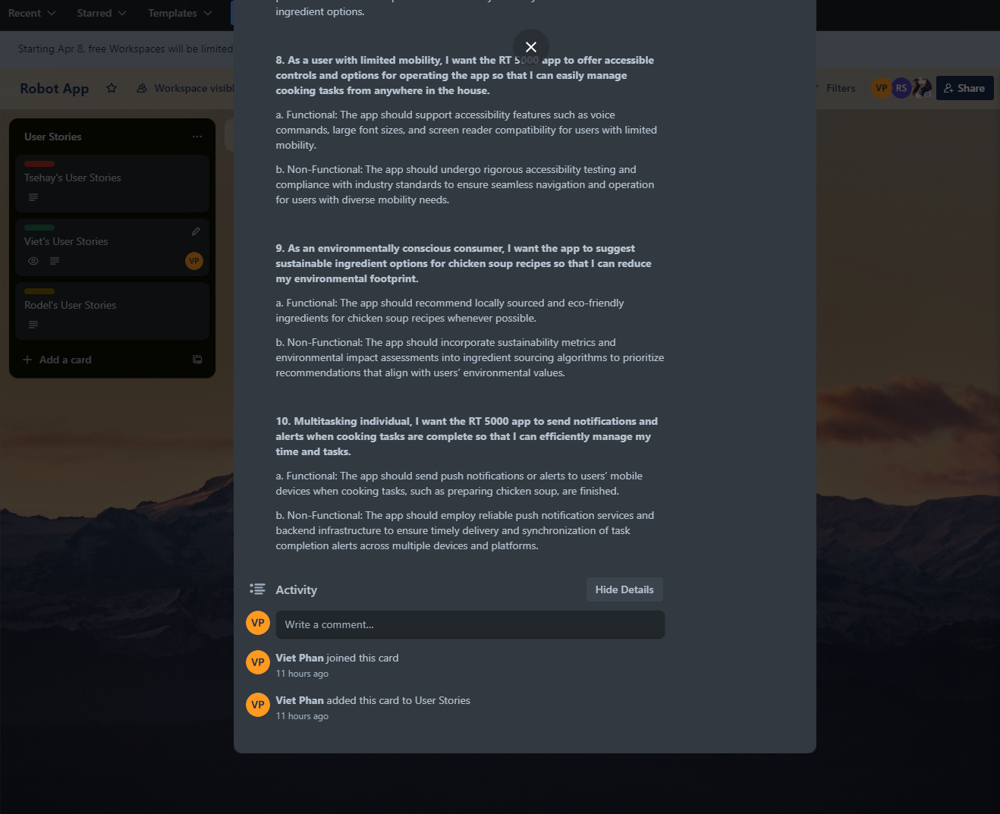
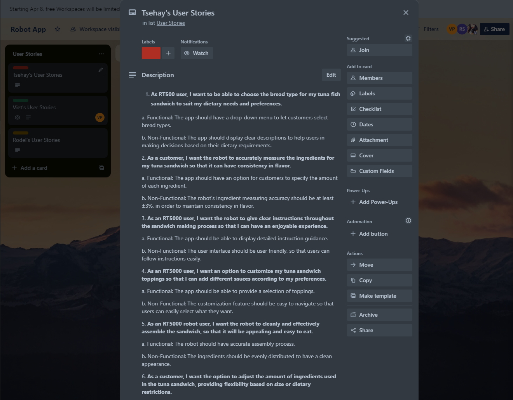
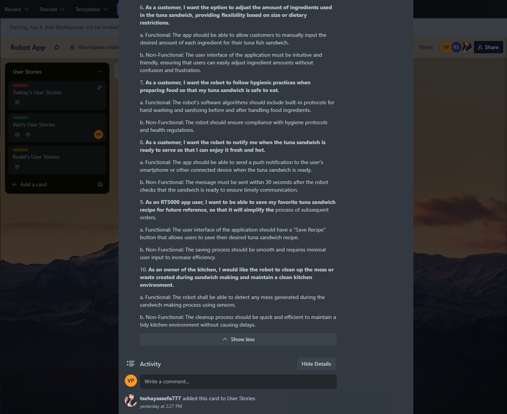
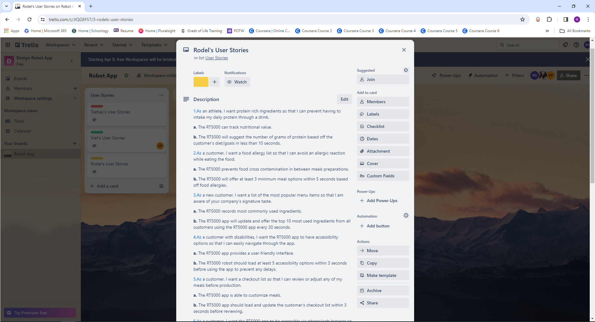
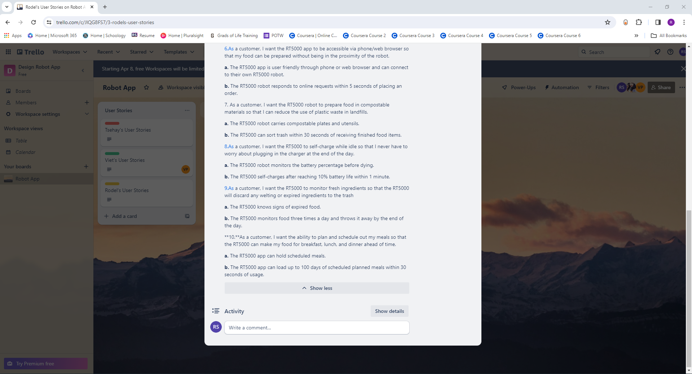

# robot-app
Apply knowledge of the Software Development Life Cycle phases and build an app for a robot

# Interview Questions

## Viet's Questions
1. What temperature does the RT 5000 maintain while cooking chicken soup? 

2. Can users specify the desired level of broth thickness for the chicken soup on the app?  

3. Are there options for users to add herbs or spices to customize the flavor of their chicken soup on the app? 

4. How does the Robo Tasker 5000 handle different cooking times for various ingredients in chicken soup? 

5. Can users choose between different types of chicken (e.g., breast, thigh, or drumstick) for their soup recipe? 

6. What size batches of chicken soup can the RT 5000 prepare at once? 

7. Are there options for users to adjust the cooking time based on their preferred texture for ingredients in the chicken soup? 

8. How intuitive is the user interface of the app for selecting chicken soup recipes 

9. Can users customize the flavors such as saltiness or spiciness in their chicken soup on the app? 

10. Does the RT 5000 app offer different ingredient options for people with diet restrictions?

## Tsehay's Questions
1. What are the key ingredients for a classic tuna fish sandwich?  

2. Can the user define bread preferences or restrictions? 

3. Do consumers want the robot to chop the sandwich in half or quarters?  

4. How should tuna be prepared? Should it be mixed with mayonnaise or other toppings? 

5. Can users add alternative components like lettuce, tomatoes, or pickles?  

6. Can users modify the sandwich with more toppings or spreads? 

7. Should the robot toast bread before creating the sandwich? 

8. Should the robot offer side dishes to the sandwich? 

9. Can users define the quantity of each ingredient to use? 

10. How should the robot present the meal, in a plate or wrap it on a use and throw paper? 

11. Should the robot provide any visual or audio signal while making the sandwich and after finishing the process?

## Rodel's Interview Questions

1.What meat proteins (beef, chicken, fish,boiled eggs, etc.) are available for the customers to add to their salad? 

2.What leafy greens (romaine, spinach, kale, lettuce, etc.) are added to the chef salad? 

3.Do the customers want the option of their salad being tossed with the dressing? 

4.What gluten free options are available for the salad dressings? 

5.Are there different types of salads available for specific food allergies (peanuts, celiac, nut allergies, etc.)? 

6.What toppings (corn, sunflower seeds, chow Mein noodles, almonds, etc.) are available to add to your salad? 

7.Are customers able to add fruit to their salad mix? 

8.Are the leafy greens washed before serving? 

9.Can the RT5000 robot cut food products with a knife?  

10.Is the RT5000 coded to ensure proper Department Of Health Food Safety regulations while serving food?

## Viet's Chicken Soup User Stories

1. As a busy parent, I want to schedule the RT 5000 to prepare chicken soup for dinner so that I can spend more time with my family in the evenings. 
- Functional: The app should allow users to set specific times for the RT 5000 to start and complete cooking tasks. 
- Non-Functional: The app should ensure seamless synchronization with users’ calendars and time zones to accurately complete cooking tasks. 

2. As a health-conscious individual, I want the option to customize the ingredients and seasons levels in my chicken soup so that I can control my dietary intake. 
- Functional: The app should provide options for users to select ingredient quantities and adjust seasoning levels according to their preference. 
- Non-Functional: The app should utilize an intuitive UI and interactive ingredient selection tool to guide users through customizing ingredient quantities and seasoning levels effectively. 

3. As a novice cook, I want clear step-by-step instructions on the app for preparing chicken soup with the RT 5000 so that I can confidently use the robot. 
- Functional: The app should include detailed, easy-to-follow cooking instructions and ingredient measurements for chicken soup recipes. 
- Non-Functional: The app should incorporate multimedia elements such as videos and interactive tutorials seamlessly to ensure smooth interaction and navigation for users. 

4. As a tech-savvy user, I want the RT 5000 app to integrate with smart home devices so that I can control cooking tasks through voice commands or automation. 
- Functional: The app should support integration with voice assistants like Alexa, Siri, or Google assistant for hands-free control of the RT 5000. 
- Non-Functional: The app should utilize reliable API integrations and adhere to protocol standards to ensure seamless compatibility with a wide range of smart home devices. 

5. As a household with dietary restrictions, I want the app to suggest alternative ingredients for chicken soup recipes based on allergy or dietary preferences so that I can accommodate everyone’s needs. 
- Functional: The app should provide options for substituting ingredients in chicken soup recipes to accommodate common food allergies or dietary restrictions. 
- Non-Functional: The app should utilize machine learning algorithms and user preference data to generate personalized ingredient substitution recommendations tailored to individual dietary needs and preferences. 

6. As a working professional, I want the RT 5000 app to offer pre-programmed chicken soup recipes with minimal setup required so that I can enjoy homemade meals without extensive preparation time. 
- Functional: The app should include a variety of pre-configured chicken soup recipes that users can select and start with minimal customization. 
- Non-Functional: The app should implement efficient recipe loading to ensure fast and responsive browsing of pre-programmed chicken soup recipes, even on slower internet connections or older devices. 

7. As a budget-conscious consumer, I want the app to provide cost-effective ingredient options for chicken soup recipes so that I can save money on grocery expenses. 
- Functional: The app should suggest affordable ingredient alternatives or provide options for purchasing ingredients in bulk for cost savings. 
- Non-Functional: The app should leverage real-time pricing data and promotional offers from partner retailers to dynamically recommend cost-effective ingredient options. 

8. As a user with limited mobility, I want the RT 5000 app to offer accessible controls and options for operating the app so that I can easily manage cooking tasks from anywhere in the house. 
- Functional: The app should support accessibility features such as voice commands, large font sizes, and screen reader compatibility for users with limited mobility. 
- Non-Functional: The app should undergo rigorous accessibility testing and compliance with industry standards to ensure seamless navigation and operation for users with diverse mobility needs. 

9. As an environmentally conscious consumer, I want the app to suggest sustainable ingredient options for chicken soup recipes so that I can reduce my environmental footprint. 
- Functional: The app should recommend locally sourced and eco-friendly ingredients for chicken soup recipes whenever possible. 
- Non-Functional: The app should incorporate sustainability metrics and environmental impact assessments into ingredient sourcing algorithms to prioritize recommendations that align with users’ environmental values. 

10. Multitasking individual, I want the RT 5000 app to send notifications and alerts when each specific cooking tasks are complete so that I can efficiently manage my time and tasks. 
- Functional: The app should send push notifications or alerts to users’ mobile devices when cooking tasks, such as preparing chicken soup, are finished. 
- Non-Functional: The push notification services, and backend infrastructure should be reliable to guarantee the prompt delivery of task completion alerts across diverse devices and platforms. 

## Tsehay's Tuna Sandwich User Stories

1. As RT500 user, I want to be able to choose the bread type for my tuna fish sandwich to suit my dietary needs and preferences. 
- Functional: The app should have a drop-down menu to let customers select bread types. 
- Non-Functional: The app should display at least 5 bread options (wheat, gluten free, white) to help users in making decisions based on their dietary requirements. 

2. As a customer, I want the robot to accurately measure the ingredients for my tuna sandwich so that it can have consistency in flavor. 
- Functional: The app should have an option for customers to specify the amount of each ingredient.  
- Non-Functional: The robot’s ingredient measuring accuracy should be at least ±3%, in order to maintain consistency in flavor.  

3. As an RT5000 user, I want the robot to give clear instructions throughout the sandwich making process so that I can have an enjoyable experience. 
- Functional: The app should be able to display detailed instruction guidance. 
- Non-Functional: The user interface should be user friendly, so that users can follow instructions easily. 

4. As an RT5000 user, I want an option to customize my tuna sandwich toppings so that I can add different sauces according to my preferences. 
- Functional: The app should be able to provide a selection of toppings. 
- Non-Functional: The customization feature should be easy to navigate so that users can easily select what they want. 

5. As an RT5000 robot user, I want the robot to cleanly and effectively assemble the sandwich, so that it will be appealing and easy to eat.  
- Functional: The robot should have accurate assembly process. 
- Non-Functional: The ingredients should be evenly distributed to have a clean appearance. 

6. As a customer, I want the option to adjust the amount of ingredients used in the tuna sandwich, providing flexibility based on size or dietary restrictions. 
- Functional: The app should be able to allow customers to manually input the desired amount of each ingredient for their tuna fish sandwich. 
- Non-Functional: The user interface of the application must be intuitive and friendly, ensuring that users can easily adjust ingredient amounts without confusion and frustration. 

7. As a customer, I want the robot to follow hygienic practices when preparing food so that my tuna sandwich is safe to eat.  
- Functional: The robot's software algorithms should include built-in protocols for hand washing and sanitizing before and after handling food ingredients. 
- Non-Functional: The robot should ensure compliance with hygiene protocols and health regulations. 

8. As a customer, I want the robot to notify me when the tuna sandwich is ready to serve so that I can enjoy it fresh and hot. 
- Functional: The app should be able to send a push notification to the user's smartphone or other connected device when the tuna sandwich is ready. 
- Non-Functional: The message must be sent within 30 seconds after the robot checks that the sandwich is ready to ensure timely communication. 

9. As an RT5000 user, I want to be able to save my favorite tuna sandwich recipe for future reference, so that it will simplify the process of subsequent orders. 
- Functional: The user interface of the application should have a "Save Recipe" button that allows users to save their desired tuna sandwich recipe. 
- Non-Functional: The saving process should be smooth and requires minimal user input to increase efficiency. 

10.  As an owner of the kitchen, I would like the robot to clean up the mess or waste created during sandwich making and maintain a clean kitchen environment. 
- Functional: The robot shall be able to detect any mess generated during the sandwich-making process using sensors 
- Non-Functional: The cleanup process should be quick and efficient to maintain a tidy kitchen environment without causing delays.

 

 

## Rodel's Chef's Salad User Stories

1. As an athlete, I want protein rich ingredients so that I can prevent having to intake my daily protein through a drink. 
- Functional: The RT5000 can track nutritional value. 
- NonFunctional: The RT5000 will suggest the number of grams of protein based off the customer's diet/goals in less than 10 seconds. 

2. As a customer, I want a food allergy list so that I can avoid an allergic reaction while eating the food. 
- Functional: The RT5000 prevents food cross contamination in between meals preparations.  
- NonFunctional: The RT5000 will offer at least 3 minimum meal options within 5 seconds based off food allergies. 

3. As a new customer, I want a list of the most popular menu items so that I am aware of your company’s signature taste. 
- Functional: The RT5000 records most commonly used ingredients. 
- NonFunctional: The RT5000 app will update and offer the top 10 most used ingredients from all customers using the RT5000 app every 30 seconds. 

4. As a customer with disabilities, I want the RT5000 app to have accessibility options so that I can easily navigate through the app. 
- Functional: The RT5000 app provides a user-friendly interface.  
- NonFunctional: The RT5000 robot should load at least 5 accessibility options within 3 seconds before using the app to prevent any delays. 

5. As a customer, I want a checkout list so that I can review or adjust any of my meals before production. 
- Functional: The RT5000 app is able to customize meals. 
- NonFunctional: The RT5000 app should load and update the customer’s checkout list within 3 seconds before reviewing. 

6. As a customer, I want the RT5000 app to be accessible via phone/web browser so that my food can be prepared without being in the proximity of the robot. 
- Functional: The RT5000 app is user friendly through phone or web browser and can connect to their own RT5000 robot. 
- NonFunctional: The RT5000 robot responds to online requests within 5 seconds of placing an order.  

7. As a customer, I want the RT5000 robot to prepare food in compostable materials so that I can reduce the use of plastic waste in landfills. 
- Functional: The RT5000 robot carries compostable plates and utensils. 
- NonFunctional: The RT5000 can sort trash within 30 seconds of receiving finished food items. 

8. As a customer, I want the RT5000 to self-charge while idle so that I never have to worry about plugging in the charger at the end of the day.
- Functional:The RT5000 robot monitors the battery percentage before dying. 
- NonFunctional: The RT5000 self-charges after reaching 10% battery life within 1 minute. 

9. As a customer, I want the RT5000 to monitor fresh ingredients so that the RT5000 will discard any welting or expired ingredients to the trash 
- Functional: The RT5000 knows signs of expired food. 
- NonFunctional: The RT5000 monitors food three times a day and throws it away by the end of the day. 

10. As a customer, I want the ability to plan and schedule out my meals so that the RT5000 can make my food for breakfast, lunch, and dinner ahead of time. 
- Functional: The RT5000 app can hold scheduled meals. 
- NonFunctional: The RT5000 app can load up to 100 days of scheduled planned meals within 30 seconds of usage. 

 

 

## Top 10 List of requirements in priority order

1. The app should follow food health standards and safety regulations. 

2. The app should adjust to dietary and allergic reaction needs. 

3. The app has a user-friendly interface. 

4. The app has clear instructions. 

5. The app should optimize performance to ensure smooth operations and reduce loading times. 

6. The app should prioritize user privacy. 

7. The app should be compatible with multiple devices. 

8. The app has customization options. 

9. The app should have user accessibility for disabilities. 

10. The app should have a feedback mechanism to gather reviews or user's input.

Explanation: The application should be created with the user in mind, with a simple interface, clear instructions, customization possibilities, and accessibility features for those with disabilities. It should also emphasize user privacy and follow food safety guidelines. To do this, user-centric considerations should be incorporated throughout the SDLC, impacting all stages from planning and design to development, testing, and deployment. This guarantees that the finished product fits user wants and expectations while adhering to safety standards. 

